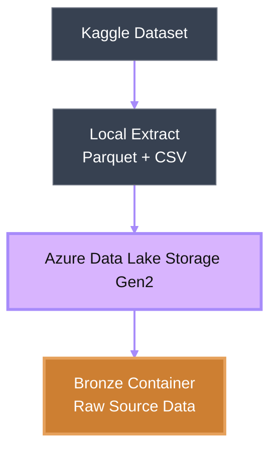

# Bronze Layer

The Bronze layer serves as the raw *ingestion* zone of the Flight Analytics Data Lakehouse.

Its primary responsibility is to store source data exactly as received, without applying business logic, transformations, or enrichment. This ensures that the original dataset remains available for auditing, reprocessing, and recovery purposes throughout the lifecycle of the project.

In a *Medallion Architecture*, the Bronze layer acts as the system of record and provides a reliable foundation for all downstream processing.

## Implementation

The Bronze layer is implemented using Azure Data Lake Storage Gen2 (ADLS Gen2).

### Storage Structure

```text
Bronze Container
│
├── Combined_Flights_2018.parquet
├── Combined_Flights_2019.parquet
├── Combined_Flights_2020.parquet
├── Combined_Flights_2021.parquet
├── Combined_Flights_2022.parquet
└── Airlines.csv
```

All files are stored in their original format and schema.

No transformations, filtering, joins, or data quality operations are performed within this layer.


## Ingestion Process

The ingestion workflow follows a simple raw-load pattern:


