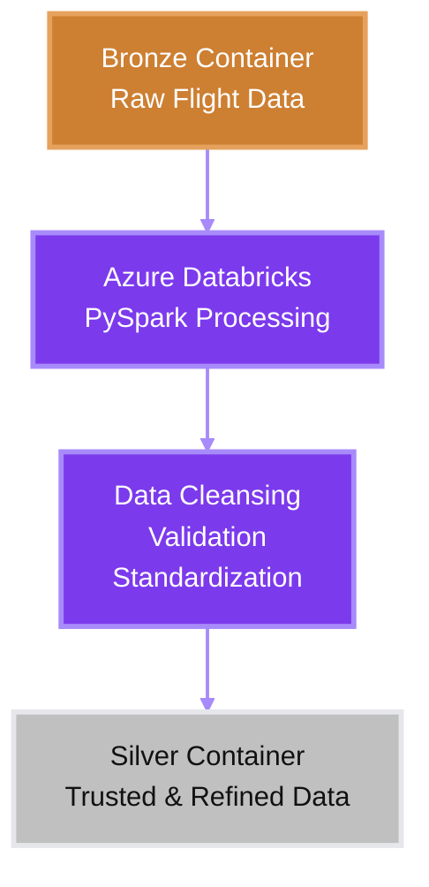

# Silver Layer

The Silver layer serves as the *cleansed and standardized* zone of the Flight Analytics Data Lakehouse.

Its primary responsibility is to improve the quality of the raw Bronze data by applying data cleansing, validation, standardization, and enrichment operations. This layer transforms raw source files into a trusted and consistent dataset suitable for downstream analytics and dimensional modeling.

In a *Medallion Architecture*, the Silver layer acts as the refined data layer between raw ingestion and business-ready reporting.

## Implementation

The Silver layer is implemented using Azure Databricks and PySpark.

Data is read from the Bronze container, transformed through a series of data quality operations, and then written back to Azure Data Lake Storage Gen2 in Parquet format.

### Storage Structure

```text
Silver Container
│
└── silver_flights/
    ├── part-00000.parquet
    ├── part-00001.parquet
    ├── part-00002.parquet
    └── ...
```

The Silver dataset contains standardized flight records that have passed validation and cleansing rules.

## Transformation Process

The following operations were performed during the Bronze → Silver transformation:

### Data Cleansing

- Removed duplicate flight records.
- Standardized column naming conventions.
- Trimmed and normalized string values.
- Handled invalid or inconsistent records.

### Data Quality

- Replaced or handled missing values where appropriate.
- Validated critical flight attributes.
- Ensured schema consistency across all yearly datasets.

### Standardization

- Unified data formats across all source files.
- Converted columns into appropriate data types.
- Prepared fields for downstream KPI calculations and dimensional modeling.

### Enrichment

- Combined yearly flight datasets into a single consolidated dataset.
- Joined airline reference information from `Airlines.csv`.
- Added business-friendly airline names alongside airline codes.

## Workflow

The Silver layer is generated through an Azure Databricks transformation pipeline.



## Role in the Data Lakehouse

The Silver layer provides a trusted foundation for analytical processing.

By ensuring data quality and consistency at this stage, downstream Gold-layer transformations can focus on business logic, KPI generation, fact tables, and dimension tables rather than raw data preparation.

This separation improves maintainability, scalability, and reliability throughout the analytics pipeline.
