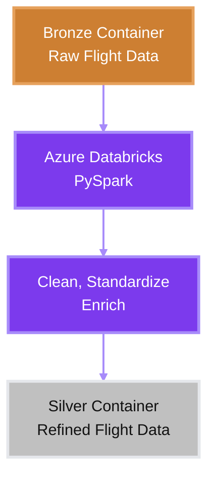

# Silver Layer

The Silver layer contains cleaned, standardized, and enriched flight data.

Raw datasets from the Bronze layer are processed using Azure Databricks and PySpark to improve data quality and create a consistent dataset for downstream analytics.

This layer serves as the bridge between raw ingestion and business-ready data.

## Implementation

Data is read from the Bronze container, transformed using PySpark, and written back to Azure Data Lake Storage Gen2 in Parquet format.

### Storage Structure

```text
Silver Container
│
└── silver_flights/
    ├── part-00000.parquet
    ├── part-00001.parquet
    ├── part-00002.parquet
    └── ...
```

## Workflow



## Purpose

The Silver layer provides a reliable dataset for the Gold layer.

By resolving data quality issues early in the pipeline, downstream transformations can focus on analytics, KPI generation, dimensional modeling, and reporting instead of data preparation.

---

This style is much closer to how high-starred data engineering repositories write documentation: short paragraphs, concrete actions, minimal buzzwords, and letting the architecture speak for itself.
